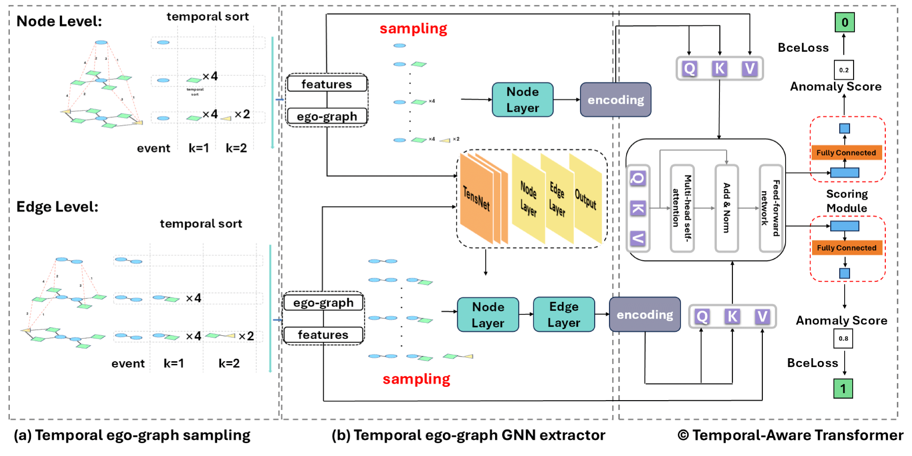

# A Generalizable Anomaly Detection Method in Dynamic Graphs
This repository contains the official implementation of the paper: ["A Generalizable Anomaly Detection Method in Dynamic Graphs"](https://arxiv.org/abs/2412.16447), accepted at AAAI 2025.
## Abstract
Anomaly detection aims to identify deviations from normal patterns within data. This task is particularly crucial in dynamic graphs, which are common in applications like social networks and cybersecurity, due to their evolving structures and complex relationships. Although recent deep learning based methods have shown promising results in anomaly detection on dynamic graphs, they often lack of generalizability. In this study, we propose GeneralDyG, a method that samples temporal ego-graphs and sequentially extracts structural and temporal features to address the three key challenges in achieving generalizability: Data Diversity, Dynamic Feature Capture, and Computational Cost. Extensive experimental results demonstrate that our proposed GeneralDyG significantly outperforms state-of-the-art methods on four real world datasets.


## Requirements


## Preprocessing
Here, we provide two preprocessed datasets: **Bitcoin-Alpha** and **Bitcoin-OTC**. Please download the preprocessed datasets [download the dataset](https://drive.google.com/drive/folders/1nJGwX0QaWZY3RH8JfqogJYMbq9PXkYhC?usp=sharing) and extract them into the current directory.

You can choose to preprocess the data before training or use the two sample files we provided. Please run the following command to preprocess the data:

```bash
python generate_datasets.py
```

### Instructions
- In `generate_datasets.py`, you can adjust the parameters `k` and `dataset_name` to generate different versions of preprocessed data.
- **`k`**: Controls specific preprocessing behaviors.
- **`dataset_name`**: Specifies the dataset to preprocess.

### Provided Preprocessed Data
We provide preprocessed versions of the **Alpha** and **OTC** datasets with `k=1`.  
These preprocessed datasets can be found in the `dataset/` directory.

### Directory Structure
```plaintext
dataset/
├── btc_alpha.pkl/
└── btc_otc.pkl/
```

## Start Training

After completing the preprocessing step, start the training process by running:

```bash
python train.py
```


